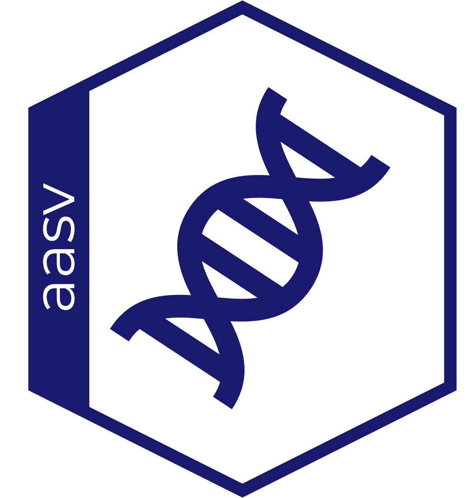

# aasv 

**aasv** is an R package for Windows that provides a complete pipeline for
assessing whether Amplicon Sequence Variants (ASVs) from COI metabarcoding
studies represent genuine biological sequences or sequencing/PCR artefacts.

Given a set of query ASVs with their taxonomy, the package:

1. Downloads COI reference sequences from BOLD up to the family level
2. Aligns them at species, genus, and family level using amino acid profiles
3. Checks and improves alignments iteratively
4. Compares each ASV's amino acid sequence against the reference database to
   flag unusual substitutions
5. Optionally maps raw reads back to each ASV with VSEARCH to assess codon
   quality
6. Computes a Functionality Index (FI) for each ASV, a continuous 0-1 score
   of how compatible the sequence is with a functional mitochondrial COI
   protein, based on codon position, amino-acid conservation, Grantham
   distance, and hydrophobicity shift

---

## Installation

**aasv** depends on several Bioconductor packages and is not available on
CRAN. Install it from GitHub using `remotes`:

```r
# Install Bioconductor dependencies first
if (!requireNamespace("BiocManager", quietly = TRUE))
  install.packages("BiocManager")

BiocManager::install(c("Biostrings", "DECIPHER", "ShortRead"))

# Then install aasv from GitHub
remotes::install_github("alexology/aasv")
```

### Optional external dependency: VSEARCH

Read-back mapping to assess per-codon sequencing quality requires
[VSEARCH](https://github.com/torognes/vsearch).  
Download a Windows binary from the
[VSEARCH releases page](https://github.com/torognes/vsearch/releases) and
note the path to `vsearch.exe`. The rest of the pipeline runs fully without
it.

---

## Pipeline overview

```
Taxonomy + ASV table
        │
        ▼
align_species_seq()   ← downloads sequences from BOLD, aligns at species level
        │
        ▼
align_genus_seq()     ← merges species alignments into genus-level profiles
        │
        ▼
align_family_seq()    ← merges genus alignments into a family-level profile
        │
        ▼
check_alignment()     ← flags alignments with internal gaps
        │
        ▼
improve_alignment()   ← removes offending sequences and re-aligns iteratively
        │
        ▼
filter_divergent_seq()   ← optionally drops residual genetic outliers
        │
        ▼
asv_functional_structure()   ← compares each ASV against the reference database
        │
        ▼
classify_asv()        ← returns a per-ASV Functionality Index (FI) and Class
```

---

## Quick start

### Step 1: Build the reference database

```r
library(aasv)

# A data frame with at least columns: family, genus, species
taxonomy <- read.csv("my_taxonomy.csv")

# Download and align sequences from BOLD
align_species_seq(
  taxonomy      = taxonomy,
  alignment_dir = "results/alignments",
  min_length    = 640,
  max_length    = 700
)

# Merge into genus-level profiles
align_genus_seq(alignment_dir = "results/alignments")

# Merge into family-level profiles
align_family_seq(alignment_dir = "results/alignments")
```

### Step 2: Check and fix alignments

```r
# Inspect for internal gaps at the species level
bad <- check_alignment(
  taxon         = "Baetidae",
  alignment_dir = "results/alignments",
  tax_lev       = "species"
)

# Iteratively remove gap-causing sequences and re-align
if (length(bad) > 0) improve_alignment(bad)

# Optionally, drop sequences that are still genetically divergent from
# every other sequence in their species-level alignment (misidentification,
# contamination, NUMTs) - run after improve_alignment()
species_alignments <- list.files(
  "results/alignments/Baetidae/species",
  full.names = TRUE, pattern = "\\.fasta$"
)
filter_divergent_seq(species_alignments)
```

### Step 3: Functional analysis

```r
# asv_taxonomy must include columns: family, genus, species, ASV
# numeric sample-abundance columns are also expected

asv_taxonomy <- read.csv("my_asv_taxonomy.csv")

# Without VSEARCH (quality columns will be NA)
asv_functional_structure(
  asv_taxonomy  = asv_taxonomy,
  output_dir    = "results",
  alignment_dir = "results/alignments"
)

# With VSEARCH read-back mapping
asv_functional_structure(
  asv_taxonomy   = asv_taxonomy,
  output_dir     = "results",
  alignment_dir  = "results/alignments",
  vsearch_path   = "C:/tools/vsearch.exe",
  trimmed_folder = "data/trimmed_reads"
)
```

### Step 4: Classify ASVs

```r
report <- classify_asv(
  output_dir           = "results",
  grantham_max          = 215,
  quality_threshold     = 0.999,
  include_position      = TRUE,
  include_grantham      = TRUE,
  include_quality       = TRUE,
  include_hydro         = TRUE,
  include_conservation  = TRUE,
  conservation_k        = 20
)

# report has columns: ASV_id, tax_lev, FI, Class, mean_conservation_weight,
# mean_conservation_confidence, mean_normalized_grantham, normalized_hydro,
# mean_site_penalty, n_pos1, n_pos2, codon_penalty, total_penalty, Evidence,
# n_aa_substitutions, n_flagged_aa_substitutions, n_ref_sequences
head(report)
```

---

## Function reference

| Function | Description |
|---|---|
| `align_species_seq()` | Download COI sequences from BOLD and align at species level |
| `align_genus_seq()` | Merge species alignments into genus-level profiles |
| `align_family_seq()` | Merge genus alignments into a family-level profile |
| `check_alignment()` | Detect alignments with internal gaps |
| `improve_alignment()` | Iteratively remove gap-causing sequences and re-align |
| `filter_divergent_seq()` | Remove sequences too genetically divergent from the rest of their species alignment |
| `re_align()` | Re-align an existing alignment with new parameters |
| `asv_functional_structure()` | Run functional analysis for all ASVs |
| `classify_asv()` | Compute the COI Functionality Index (FI) for each ASV |
| `aa_similarity_matrix()` | Compute pairwise codon similarity matrix |

---

## How classification works

`classify_asv()` computes a **Functionality Index (FI)**: a continuous 0-1
score of how compatible a query sequence is with the evolutionary constraints
expected of a functional mitochondrial COI protein. FI is a compatibility
score, not an estimate of the probability that a sequence is mitochondrial
vs. nuclear (NUMT) in origin.

1. **Hard incompatibility check**: if the ASV introduces internal gaps when
   aligned to the reference (a premature stop codon, frameshift, or
   non-triplet indel), `FI = 0` and the ASV is classified *"Severe
   incompatibility with functional COI."*, skipping the checks below.
2. **Soft site-level penalty**: for sequences with a valid ORF, every
   amino-acid position where the ASV differs from the reference database
   contributes a `site_penalty = conservation_weight × normalized_grantham`:
   - *Conservation weight* (toggle `include_conservation`): how invariant
     that position is across the family-level reference alignment
     (Shannon entropy-based), discounted by a confidence factor `1 -
     exp(-n_ref / conservation_k)` that grows with the number of reference
     sequences behind the position, so a position that merely looks invariant
     because only a couple of references cover it is trusted less than the
     same apparent conservation backed by hundreds
   - *Grantham distance* (toggle `include_grantham`, normalized by
     `grantham_max`) is the position's biochemical severity
   - *Sequencing quality* (toggle `include_quality`, requires VSEARCH):
     positions below `quality_threshold` are excluded from scoring entirely,
     since the call cannot be trusted; `NA` quality (no VSEARCH) is always
     treated as reliable
3. **Codon-position penalty** (toggle `include_position`): second-codon-
   position substitutions are weighted twice as heavily as first-position
   ones; synonymous third-position-only changes contribute nothing
4. **Sequence-level hydrophobicity penalty** (toggle `include_hydro`): the
   query's local violation rate against the family hydrophobicity envelope
   is a whole-protein property, not a per-residue one, so it is kept as an
   independent term rather than being repeated across every mutated site

The mean site penalty (35%), the codon-position penalty (30%), and the
sequence-level hydrophobicity term (35%) combine into a total penalty, and
`FI = 1 - total_penalty`. The resulting `Class` is one of:

| FI range | Class |
|---|---|
| ≥ 0.90 | Plausible functional sequence |
| < 0.90 | Artifact-NUMTs candidate |
| (hard incompatibility) | Severe incompatibility with functional COI. |

Each `include_*` toggle defaults to `TRUE`; disabling one removes that
evidence source from the score entirely. FI is reported per ASV per
taxonomic level with a human-readable `Evidence` string, alongside every
submetric that fed into it: `mean_conservation_weight`,
`mean_conservation_confidence` (the raw `1 - exp(-n_ref / conservation_k)`
factor, reported separately from the weight it discounts),
`mean_normalized_grantham`, `normalized_hydro`, `mean_site_penalty`,
`n_pos1`/`n_pos2`, `codon_penalty`, and `total_penalty` - so the FI
computation can be audited row by row.

`classify_asv()` reports every ASV/taxonomic-level combination that was
processed upstream, not only the ones with a flagged amino-acid
substitution: an ASV whose ORF matches the reference at every position never
gets an `<ASV_id>_aa_structure.xlsx` file, but it is still listed (with
`n_aa_substitutions = 0`) as long as it appears in `hydrophobicity.xlsx`.

---

## Acknowledgments
This work was funded by the European Union under the NextGeneration EU 
Programme within the Plan “PNRR - Missione 4 “Istruzione e Ricerca” - Componente
C2 Investimento 1.1 “Fondo per il Programma Nazionale di Ricerca e Progetti 
di Rilevante Interesse Nazionale (PRIN)” by the Italian Ministry of University 
and Research (MUR), Project title: “METAbarcoding for METAcommunities: towards 
a genetic approach to community ecology (META2) ”, 
Project code: 2022PA3BS2 (CUP D53D23008270006), MUR D.D. 
financing decree n. 1015 of 07/07/2023

Claude Code has been used to check, test and improve existing code.

---

## Citation

If you use **aasv** in your research, please cite:

> Gruppuso L., Brunelli N., Voyron S., Bertolino D., Roggero A., Palestrini C.,
> Laini A. (2026). *aasv: an R package for functional
> assessment of COI metabarcoding ASVs*. (in preparation)

---

## License

GPL (>= 2)
